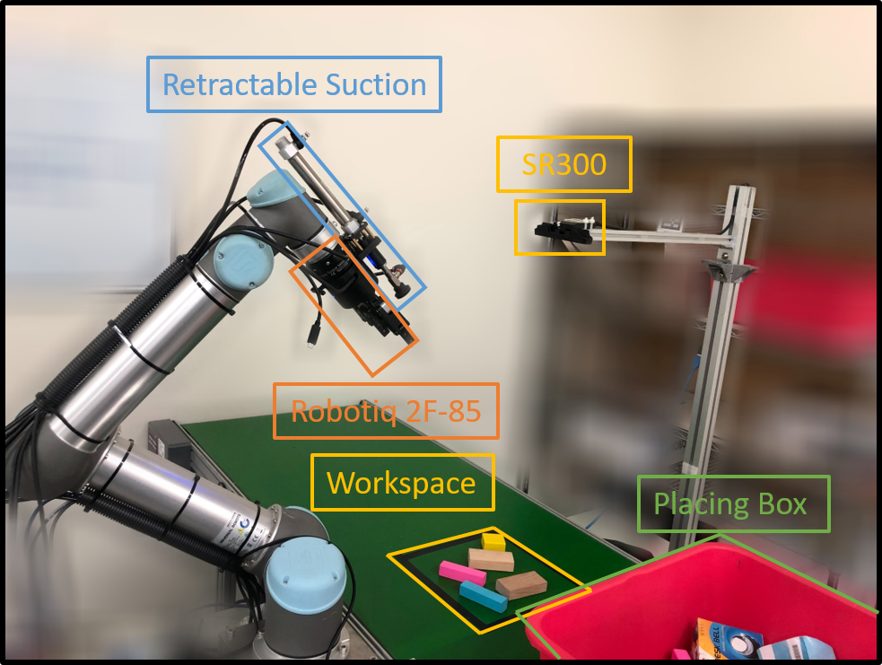
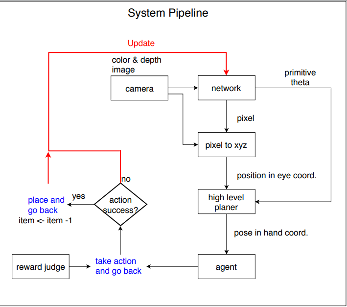
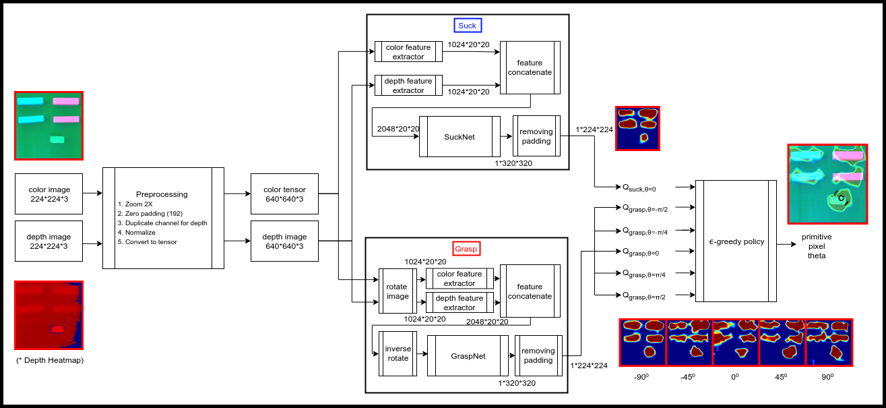

# Table of Contents
1. [How to Start](#Start)
2. [Launch](#Launch)
3. [System Pipeline](#Pipeline)
4. [Services](#Services)
5. [Network](#Network)

## How to start <a name="Start"></a>
```
$ cd && git clone https://github.com/sean85914/flip_object.git && cd flip_object && catkin_make
$ source devel/setup.bash # DO THIS IN EACH NEW TERMINAL
[Terminal 1] $ roslaunch arm_operation ur5_real.launch robot_ip:=192.168.50.11 tool_length:=0.0
[Terminal 2] $ roslaunch realsense2_camera rs_rgbd.launch camera:=camera1
[Terminal 3] $ roslaunch grasp_suck grasp_suck_system.launch
[Terminal 4] $ rosrun rviz rviz -d src/visualization/config/system.rviz
[Terminal 5] $ cd src/grasp_suck/src && python main.py [--force_cpu] [--model PATH_TO_YOUR_MODEL] [--epidode EPISODE] [--epsilon epsilon] [--num_of_items NUM_OF_ITEMS] [--update_target UPDATE_TARGET]
```
For testing, run
```
[Terminal 5] $ python main.py --is_testing [--force_cpu] [--grasp_only] [--episode EPISODE] [--model PATH_TO_YOUR_MODEL] [--num_of_items NUM_OF_ITEMS] [--update_target UPDATE_TARGET]
```
## System Pipeline <a name="Pipeline"></a>

The system is start with <code>item = N</code> and the process will stop after <code>item = 0</code>

## grasp_suck_system.launch <a name="Launch"></a>

| Type   | Path    | Description |
| :---:  | :---:   | :---:       |
| launch | arm_operation/tcp_publisher.launch                    | Suction and 2-finger gripper transformation information |
| node   | vacuum_conveyor_control/arduino_control               | Turn on vacuum control services |
| node   | robotiq_2f_gripper_control/Robotiq2FGripperRtuNode.py | Turn on robotiq 2-finger gripper |
| node   | grasp_suck/robotiq_gripper_control                    | Trun on robotiq gripper control services |
| node   | visual_system/pc_transform                            | Transform point cloud from eye coord. to hand coord. <br> Check if workspace is empty </br> |
| ~~node~~   | ~~grasp_suck/get_reward~~                                 | ~~Using consecutive depth images to judge if action succeed <br>TODO: use air pressure sensor to check if suck success</br>~~ |
| launch | grasp_suck/helper_services.launch                     | High-level services, including homing, picking and placing | 
| node | robotiq_ft_sensor/rq_sensor | Open force torch sensor, only do if use_ft set to true | 
| node | visualization/viz_boundary.py | Visualize the limits of work space |
| node | visualization/viz_marker.py | Service to visualize the primitive and text markers |

## Services List <a name="Services"></a>

| Service name                              | Service type | Description |
| :---:                                     | :---: | :---: |
|<tr><td colspan=3><p align="center">**Gripper Related**</p></td></tr>|
| /arduino_control/pheumatic_control | [std_srvs/SetBool](http://docs.ros.org/melodic/api/std_srvs/html/srv/SetBool.html) | Suction cup expansion and contraction |
| /arduino_control/vacuum_control    | [vacuum_conveyor_control/vacuum_control](https://github.com/sean85914/flip_object/blob/master/src/vacuum_conveyor_control/srv/vacuum_control.srv) | Suction behavior control | 
| /arduino_control/check_suck_success | [std_srvs/SetBool](http://docs.ros.org/melodic/api/std_srvs/html/srv/SetBool.html) | Check if suck success |
| /robotiq_finger_control_node/intial_gripper | [std_srvs/Empty](http://docs.ros.org/melodic/api/std_srvs/html/srv/Empty.html) | Initialize gripper |
| /robotiq_finger_control_node/close_gripper | [std_srvs/Empty](http://docs.ros.org/melodic/api/std_srvs/html/srv/Empty.html) | Close gripper |
| /robotiq_finger_control_node/open_gripper  | [std_srvs/Empty](http://docs.ros.org/melodic/api/std_srvs/html/srv/Empty.html) | Open gripper | 
| /robotiq_finger_control_node/get_grasp_state | [std_srvs/SetBool](http://docs.ros.org/melodic/api/std_srvs/html/srv/SetBool.html) | Get if grasp success |
|<tr><td colspan=3><p align="center">**Robot Arm Related**</p></td></tr>|
| /ur5_control_server/ur_control/goto_joint_pose | [arm_operation/joint_pose](https://github.com/sean85914/flip_object/blob/master/src/arm_operation/srv/joint_pose.srv) | Go to user given joint pose |
| /ur5_control_server/ur_control/goto_pose | [arm_operation/target_pose](https://github.com/sean85914/flip_object/blob/master/src/arm_operation/srv/target_pose.srv) | Go to user given cartesian pose | 
|<tr><td colspan=3><p align="center">**Visual Related**</p></td></tr>|
| ~~/get_reward/get_result~~ | ~~[grasp_suck/get_result](https://github.com/sean85914/flip_object/blob/master/src/grasp_suck/srv/get_result.srv)~~ | ~~Use consecutive depth heightmaps to determine if suck success~~ |
| /pc_transform/get_pc | [visual_system/get_pc](https://github.com/sean85914/flip_object/blob/master/src/visual_system/srv/get_pc.srv) | Get pointcloud inside the workspace with coordinate of robot arm |
| /pc_transform/empty_state | [visual_system/pc_is_empty](https://github.com/sean85914/flip_object/blob/master/src/visual_system/srv/pc_is_empty.srv) | Get if workspace is empty |
|<tr><td colspan=3><p align="center">**High-level Services**</p></td></tr>|
| /helper_services_node/goto_target | [grasp_suck/get_pose](https://github.com/sean85914/flip_object/blob/master/src/grasp_suck/srv/get_pose.srv) | Make arm contact with request point with specific motion primitive and angle
| /helper_services_node/robot_go_home | [std_srvs/Empty](http://docs.ros.org/melodic/api/std_srvs/html/srv/Empty.html) | Return arm to home and set posterior |
| /helper_services_node/robot_go_place | [std_srvs/Empty](http://docs.ros.org/melodic/api/std_srvs/html/srv/Empty.html) | Place the object with predifined pose |
|<tr><td colspan=3><p align="center">**Visualization**</p></td></tr>|
| /viz_marker_node/viz_marker | [visualization/viz_marker](https://github.com/sean85914/flip_object/blob/master/src/visualization/srv/viz_marker.srv) | Visualize primitive and text markers |

## Network <a name="Network"></a>
**Network Flowchart**

### TODO： add description
1. [models.py](https://github.com/sean85914/flip_object/blob/master/src/grasp_suck/src/models.py)
2. [trainer.py](https://github.com/sean85914/flip_object/blob/master/src/grasp_suck/src/trainer.py)  
